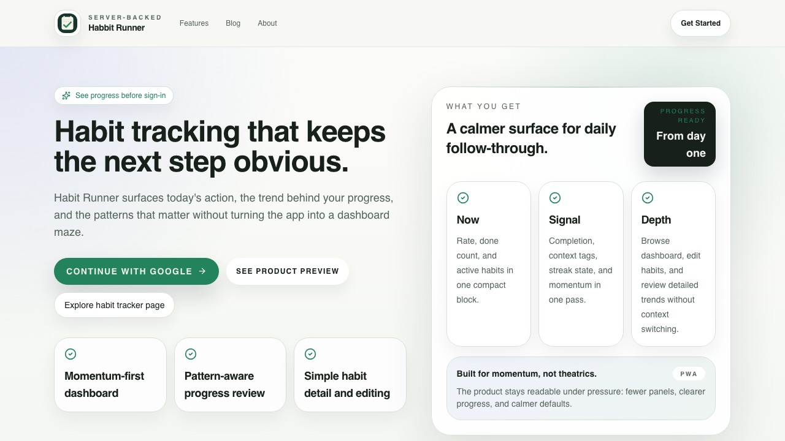
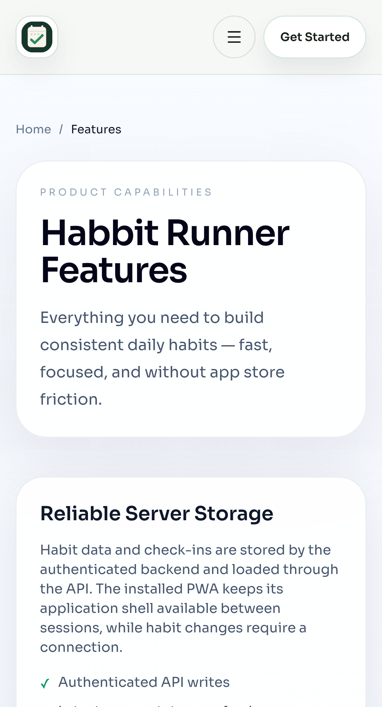
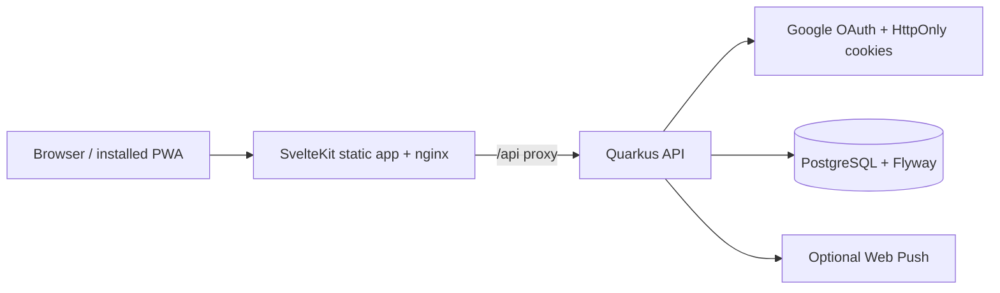

# Habbit Runner

<p align="center">
  <strong>A calmer, server-backed habit tracker for consistent daily follow-through.</strong><br />
  SvelteKit 2 · Svelte 5 · Quarkus 3 · PostgreSQL · Flyway · Docker · GitHub Actions
</p>

<p align="center">
  <a href="#product">Product</a> ·
  <a href="#engineering-highlights">Engineering</a> ·
  <a href="#screenshots">Screenshots</a> ·
  <a href="#run-locally">Run locally</a> ·
  <a href="#quality-evidence">Quality</a>
</p>

<a id="top"></a>

## Table of contents

- [🎯 Product](#product)
- [🧩 Engineering highlights](#engineering-highlights)
- [🖼️ Screenshots](#screenshots)
- [🏗️ Architecture](#architecture)
- [🚀 Run locally](#run-locally)
- [🧪 Quality evidence](#quality-evidence)
- [🗂️ Repository map](#repository-map)
- [📚 Further reading](#further-reading)
- [⚠️ Scope and limitations](#scope-and-limitations)

## 🎯 Product <a id="product"></a>

Habbit Runner is a focused PWA for people who want the next useful action to be
obvious. It surfaces today’s habits, completion context, streak momentum, and
longer-term progress without turning the product into a dashboard maze.

This repository is a portfolio project demonstrating end-to-end ownership of a
small production-shaped web system:

- authenticated habit and check-in workflows;
- durable account preferences restored after re-login;
- schedule-aware streak, flame, and inactivity/ice signals;
- responsive cards and compact rows for desktop and mobile;
- a backend-first API contract with migration-safe persistence;
- reproducible local Docker smoke checks and path-aware CI.

[↑ Back to top](#top)

## 🧩 Engineering highlights <a id="engineering-highlights"></a>

| Area | Evidence in this repository |
| --- | --- |
| Frontend | SvelteKit 2, Svelte 5, typed API clients, shared TypeScript contracts, Playwright journeys |
| Backend | Quarkus 3 resources, service boundaries, JPA/Hibernate persistence, Jakarta validation |
| Data | PostgreSQL, additive Flyway migrations, optimistic versioning, stable ownership checks |
| Authentication | Google OAuth, HttpOnly access/refresh cookies, CSRF protection, refresh-token rotation |
| Reliability | Request trace IDs, explicit error responses, readiness/health checks, bounded smoke stack |
| Delivery | Maven/npm caches, OpenAPI snapshot drift checks, Trivy, path-aware GitHub Actions lanes |
| PWA | Installable application shell with production build verification; habit data remains server-backed |

The most important architectural decision is backend-first state ownership:
authenticated habit and check-in mutations are accepted by the API before the UI
reflects them. Browser storage is used only for intentionally local concerns and
first-paint fallbacks.

[↑ Back to top](#top)

## 🖼️ Screenshots <a id="screenshots"></a>

The images are tracked repository assets with explicit relative paths, so they
render in GitHub, pull requests, and local Markdown previews.

<p>
  
</p>
<p align="center"><em>Landing page — desktop presentation and product positioning.</em></p>

<p align="center">
  
</p>
<p align="center"><em>Features page — mobile layout and responsive information hierarchy.</em></p>

To replace these captures, keep the same tracked paths and export PNG files under
`docs/assets/screenshots/`. The repository also contains the capture note at
[`apps/web/static/screenshots/README.md`](apps/web/static/screenshots/README.md).

[↑ Back to top](#top)

## 🏗️ Architecture <a id="architecture"></a>



The main runtime path is:

```text
Svelte component
  -> frontend store / typed client
  -> authenticated REST resource
  -> application service
  -> repository / JPA entity
  -> PostgreSQL migration-backed schema
  -> normalized response DTO
```

The installed PWA caches the application shell for repeat visits. It is not an
offline habit database, so users do not receive a false “saved” state when the
server has not accepted a mutation.

[↑ Back to top](#top)

## 🚀 Run locally <a id="run-locally"></a>

### Prerequisites

- Docker Compose with a running Docker engine;
- Node.js 22.12 or newer;
- Java 25 and the Maven wrapper;
- Google OAuth credentials only if testing the real sign-in flow.

### Full local stack

```bash
cp .env.example .env
docker compose --profile db up --build --wait
```

Open [http://localhost:5137](http://localhost:5137), or the configured
`WEB_PORT`. Stop the stack with `docker compose --profile db down`.

### Host-based development

```bash
cd apps/web && npm ci
cd apps/web && npm run dev:server
```

For environment variables, OAuth callback setup, and direct Quarkus mode, see
[`docs/setup/getting-started.md`](docs/setup/getting-started.md).

### Bounded Docker proof

```bash
./scripts/ci/smoke-stack.sh
```

The script builds the API and web images, starts PostgreSQL/Flyway, checks health
and `/api` proxy routing, then removes its containers, network, and test volume.

[↑ Back to top](#top)

## 🧪 Quality evidence <a id="quality-evidence"></a>

Run the cheapest checks first during development:

```bash
cd apps/web && npm run test
cd apps/web && npm run check
cd apps/web && npm run test:e2e
cd apps/backend && ./mvnw -B -ntp verify
cd apps/backend && ./mvnw -B -ntp verify -Ppostgres-it
actionlint .github/workflows/quality.yml
docker compose --env-file .env.example --profile db config --quiet
```

The current local evidence includes 190 frontend unit tests, 173 backend tests,
and 8 Playwright scenarios across desktop and compact mobile. Local checks prove
the checkout; they do not prove a pushed GitHub Actions run, deployed OAuth, or
production-device PWA update behavior.

[↑ Back to top](#top)

## 🗂️ Repository map <a id="repository-map"></a>

```text
apps/web/                  SvelteKit UI, API clients, unit and Playwright tests
apps/backend/              Quarkus resources, services, entities, migrations
spec/openapi/              Generated OpenAPI snapshot
scripts/ci/                Local and CI quality automation
docs/                      Architecture, setup, operations, and delivery notes
docker-compose.yml         Portable JVM + PostgreSQL + nginx stack
```

[↑ Back to top](#top)

## 📚 Further reading <a id="further-reading"></a>

- [Architecture overview](docs/architecture/overview.md)
- [API contract](docs/architecture/api-contract.md)
- [Getting started and OAuth setup](docs/setup/getting-started.md)
- [GitHub Actions and smoke checks](docs/operations/github-automation.md)
- [Monitoring contract](docs/monitoring/newrelic.md)
- [Dashboard preferences and momentum delivery](docs/dashboard-preferences-momentum-ci-backlog.md)
- [Documentation hub](docs/README.md)
- [License](LICENSE)

[↑ Back to top](#top)

## ⚠️ Scope and limitations <a id="scope-and-limitations"></a>

- Google OAuth and external push delivery require configured credentials.
- Habit changes require a connection to the authenticated API.
- GitHub Actions minute savings must be confirmed from fresh remote workflow runs;
  local `actionlint` and build checks cannot measure hosted-run cost.
- The screenshots are product/marketing captures, not proof of a signed
  production deployment.

[↑ Back to top](#top)
