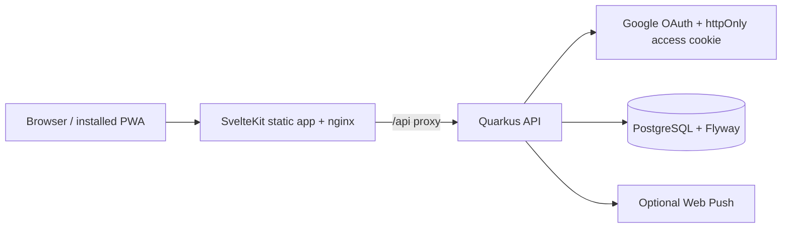

# Habbit Runner

Habbit Runner is a server-backed habit tracker for people who want a small,
reviewable daily system instead of a noisy productivity suite. The intentional
`Habbit` spelling is the product brand; it is not a pending repository rename.

The portfolio demonstrates a SvelteKit 2 / Svelte 5 PWA, a Quarkus 3 API, and
PostgreSQL persistence with Google OAuth, optimistic locking, Flyway migrations,
safe error contracts, and optional web push notifications.

## Verified product path



Habit and check-in mutations are backend-first: the authenticated API is the
source of truth and writes are reflected in the UI only after the server accepts
them. The PWA caches the application shell for repeat visits; it is not an
offline habit data store.

## Architecture decisions

- SvelteKit frontend with typed API clients and shared TypeScript DTOs.
- Quarkus resources delegate to services and repositories; PostgreSQL schema
  changes are managed by Flyway.
- HttpOnly access/refresh cookies, CSRF protection for mutations, resource
  ownership checks, and optimistic version conflicts protect account data.
- Micrometer metrics export to New Relic is opt-in. Default tracing is request
  correlation via `x-trace-id`; OpenTelemetry is disabled until an OTLP receiver
  is configured and verified.

## Ten-minute local startup

Prerequisites: Docker Compose, Node.js 22.12+, Java 25, and OrbStack or Docker.

```bash
cp .env.example .env
docker compose --profile db up --build --wait
```

Open the web container through the deployment's published route. For a bounded
local proof of image build, Flyway startup, readiness, and nginx `/api` routing:

```bash
DOCKER_HOST=unix:///Users/sash/.orbstack/run/docker.sock ./scripts/ci/smoke-stack.sh
```

The script always removes its containers and database volume. Host-based
frontend/backend development and Google OAuth setup are documented in
[`docs/setup/getting-started.md`](docs/setup/getting-started.md).

## Quality evidence

```bash
cd apps/web && npm run check:web
cd apps/web && npm test
cd apps/web && npm run test:e2e
cd apps/backend && ./mvnw -B -ntp verify
cd apps/backend && ./mvnw -B -ntp verify -Ppostgres-it
actionlint .github/workflows/quality.yml
```

CI also runs Trivy, OpenAPI snapshot drift protection, and the Docker contract
smoke job. Browser E2E uses deterministic API stubs for repeatability; it does
not replace real OAuth, cookie, PostgreSQL, or deployed-environment proof.

## Repository map

```text
apps/web/                  SvelteKit UI, API clients, unit and Playwright tests
apps/backend/              Quarkus resources, services, persistence, migrations
spec/openapi/              Generated OpenAPI snapshot
scripts/ci/                Local/CI quality automation
docs/                      Architecture, setup, operations, roadmap, limitations
docker-compose.yml         Portable JVM + PostgreSQL + nginx stack
```

## Screenshots


## Further reading

- [Architecture overview](docs/architecture/overview.md)
- [API contract](docs/architecture/api-contract.md)
- [Security and setup](docs/setup/getting-started.md)
- [Monitoring contract](docs/monitoring/newrelic.md)
- [GitHub automation](docs/operations/github-automation.md)
- [Roadmap](docs/roadmap.md)
- [Limitations](docs/limitations.md)
- [Portfolio backlog](docs/portfolio-readiness-backlog.md)
- [License](LICENSE)
